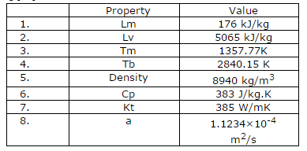
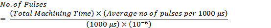
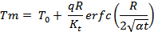
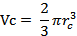
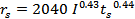
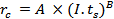
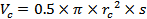
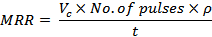
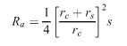

### Procedure
A comparative study of an point and disk heat source model is presented herewith. The work piece material considered for the experiment is Copper with following properties.

1. Samples of copper were cut to a length of 7.0 mm with each cut 2 mm apart. The cut was set by manual programming.
2. Electronic balance was set up for stabilization nearly 30 minutes before the operation. After the cut, the workpiece was properly dried and weighed on the balance to find out mass of machined material.
3. Digital oscilloscope was connected to the machine wire and machine ground to measure number of pulses using sampling method.
4. Machine settings were changed after every cut to observe effect on performance and all the relevant factors were noted down.

**1 Pulse measurement**
Measurement of number of pulses:
* For the measurement of pulses, Techtronix oscilloscope is used. Probes are connected to anode (wire electrode) and cathode (work piece- table) and voltage pulse train is captured.
* Number of pulses is counted on the horizontal scale adjusting it to 1000. Five such readings are taken for each cut and then average is found out.
* Total machining time is counted using a stop watch. From this, number of pulses for total machining time is found out using following formula -

**2 Calculations using DiBitonto's Model**
Radius of crater predicted by this model was calculated using following relation [4]

This equation was solved for calculating R using numerical methods.

**MRR calculation**
Volume of crater, Vc was calculated using following relation:

**3 Calculations using Salonitis Model**
Radius of heat source was calculated using following equation:

Using the constants A and B used by Rebelo et al. radius of crater was calculated:

**3.1 MRR calculation**
For copper,
A=1743, B=0.37 [22]
Volume of a single crater was calculated by:

Material removal rate was calculated using the equation:

**3.2 Surface Roughness Approach:**
Salonitis also proposed a different approach which established relationship between radius of crater and surface roughness. Based on the parabolic geometry of the crater, which is the basic assumption of this model, following relationship was proposed:

After cutting, surface roughness of the machined component was measured on Taylor-Hobson surface roughness tester. Based on those values, new crater radius were estimated.