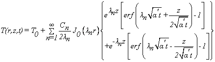
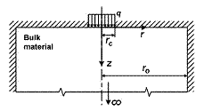
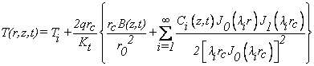
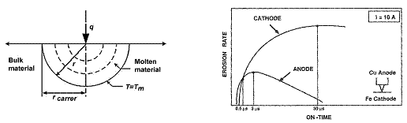
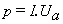
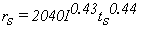
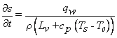

### Theory
Among the various models developed by different researchers, the basic accepted Thermal models are represented here along with assumptions.

**Snoeys's Model** (1971) Snoeys proposed a first ever widely acknowledged thermal model for EDM process and Figure 3.1 shows graphically representation of the model.

**Features**

1. Heat source is assumed to be of disk shape on the surface of electrode.
2. Cathode surface is assumed to be insulated at the outer area.
3. Radius at insulated surface is assumed 100 times, the radius of disk heat source.
Heat source assumed to be existent for the pulse-on-time with the gradually increasing and then decreasing heat source radius.

Fig. 3.1 Snoeys's model

 
Fraction of discharge energy transferred to cathode is assumed to be 50% (Fc = 0.5).

Based on the assumptions used, the temperature distribution at the cathode is given as equation

------- (3.1)

 
where,

 

**Van Dijck's Model** (1974) the model which accounts for the two-dimensional nature of the heat flow is solved for two cases, finite and infinite dimension in the z direction. However, the latter case is similar to Snoeys's model. The first case of a finite dimension in the z direction is simplified than infinite case.

**Features**

1. The fraction of the energy transferred to the cathode is taken as 50% (Fc = 0.5).
2. The entire electrode and workpiece surfaces were assumed to be insulated outside the heat source.
3. The whole medium is assumed to be initially at ambient temperature.
4. A method to account the change in radius of heat source with time is proposed.
The schematic diagram of Van Dijck's model is illustrated in the Figure 3. 2.

 Fig. 3.2 Van Dijck's model

 
The superposition principle and separation of variables were applied to the partial differential equation and the solution of the temperature distribution is given as

 ------- (3.2)

 
for,

&emsp;  

**Beck's Model** (1981) is also another disk heat source model. This mode is not developed specifically for the EDM process but resembles to the one. Figure 3.3 shows the schematic representation of the model.

**eatures**
1. A disk shaped region over material surface is considered to be heated by heat flux.
2. The entire electrode surface is considered to be insulated; except over the circular region where the heat flux strikes the material surfaces.
As the model is not developed specifically for the EDM process, the heat flux did not take into account the fraction of energy transferred to the cathode.

  fig. 3.3 Beck's model

 
The temperature distribution is given by equation (3.3),

 ------- (3.3)

 
Where;

**Jilani's Model** (1983, 1986) and P.C. Pandey of University of Rurkee proposed a thermal model of EDM in 1983. Figure 3.4 shows the schematic representation of the model.

 fig. 3.4 Jilani's model

 
**Features**

1. This model assumes that the heat from the plasma channel is transferred to the workpiece or tool only by conduction.
2. The electrode is a semi-infinite body with radius ro.
3. About 90% of the total energy liberated is conducted to the discharge gap and it was distributed equally between the anode and cathode (Fc = 0.5).
4. The plasma channel has been considered to be a disk heat source situated between two semi-infinite bodies (tool and workpiece).
5. The radius of heat flux is considered constant regardless of the discharge conditions.
6. The electrode surfaces are completely insulated except for the portion where the heat flux strikes the material surfaces.
The temperature distribution was derived using an infinite number of instantaneous point heat sources distributed round the circle, and it is given by equation (3.4).

 ------- (3.4)

 
In order to reach a reasonable degree of approximation, the model takes into account the effect of plasma channel growth through a constant surface temperature approach. Thus, the temperature at the center of the cathode spot was assumed to remain constant throughout the pulse on duration and equal to the boiling temperature of the cathode material. The boiling temperature of cathode material which is used to determine the crater radius is given as equation (3. 5):

 ------- (3.5)

 
**DiBitonto's Model** (1989) of Texas A&M; University, America conducted a series of experiments in association with AGIE Corporation, a leading EDM manufacturer.
Figure 3.20 illustrates the spherical symmetry resulting from assumptions as well as the melt front radius (r-crater) of the material.

**Features**
1. Unlike all previous models, this model assumed a point heat source (PHSM) instead of a disk for conduction into its interior. This is because the plasma radius at the cathode was assumed to be much smaller than that at the anode.
2. The energy distributed to the cathode for erosion is assumed to be 18% (Fc = 0.18).

 fig. 3.5 Dibitonto's model

 
The temperature distribution was given by Carslaw and Jaeger in1956 as,

This equation assumes constant current I during the pulse. At the melt radius R,

Along the interface where the phase change takes place (T=Tmelt) the equation (3.8) holds

where, &lambda;f = heat of fusion, Vc = molten cavity volume.

**K. Salonitis's Model** (2006)

**Features:** It is assumed that the distance from the workpiece surface at which the temperature exceeds the melting point coincides with the crater depth, neglecting the formation of a recast layer. It is completely new and simple approach of thermal modeling where new concept of erosion front velocity is introduced

and Figure 3.6 represents the schematic diagram for the model

The crater is assumed to have circular paraboloid geometry and its diameter on the surface is determined from the empirical relations in equation (3.9).

&emsp; (3.9)

 
where, Ra is average surface roughness.

Heat balance equation at the erosion front was given by equation (3.10).

       (3.10)

 
where,

  and (3.11)

 
And the velocity on erosion front is stated as –

**Summary:** From the literature survey carried out it has been observed that the models developed can be widely classified into two sub groups depending upon the geometry considered of the heat source (viz. point and disk heat source). The geometry of the heat source considered will finally affect the profile of the crater obtained. The resultant material removal rate obtained will be estimated from the volume of these individual craters. On the basis of these estimates one can compare the models with each other and further with the experimental results obtained. Hence this experiment emphasizes on the comparative study of Saloniti's model (disk heat source) and Dibitonto's model (point heat source). Further the predicted results are compared with the experimental ones.

